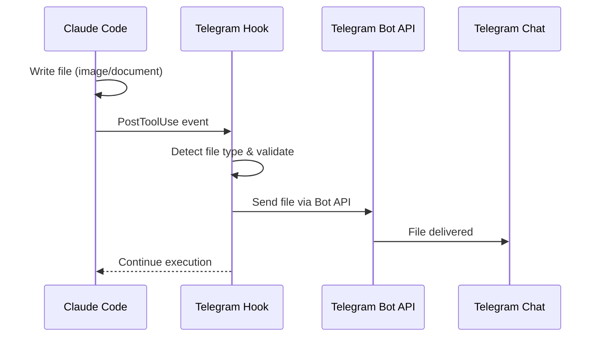
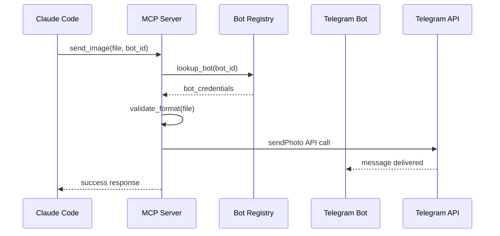

# Telegram File Sender - Technical Specification

## Overview

This document outlines the technical specification for enabling Claude Code to send files, images, audio, and voice messages to Telegram Bot instances. After research of Claude Code's latest features, two main approaches are available: **Custom Hooks System (RECOMMENDED)** and MCP Server integration. The solution addresses the need for seamless integration between Claude Code development workflows and Telegram Bot communication.

## Problem Statement

### Core Requirements
- Enable Claude Code to send various file types to active Telegram Bot instances
- Support images, documents, audio files, and voice messages
- Maintain session isolation between different bot instances
- Avoid interference with terminal-based Claude Code sessions
- Support multiple concurrent bot instances (4-20+ bots)

### Key Challenges
1. **Session Isolation**: Different Claude Code sessions (terminal vs bot1 vs bot2) should not interfere with each other
2. **Bot Instance Management**: Multiple bot instances require unique identification and routing
3. **File Format Compatibility**: Telegram Bot API requires specific formats for different media types
4. **Integration Complexity**: MCP servers are typically project-scoped, but bots work across projects

## Technical Analysis

### Claude Code CLI Flags Reference

Based on official documentation, Claude Code provides extensive command line configuration options:

```bash
Usage: claude [options] [command] [prompt]

Key Options for Integration:
  --output-format <format>           Output format: "text", "json", "stream-json"
  --input-format <format>            Input format: "text", "stream-json" 
  --allowedTools <tools...>          Comma/space-separated list of allowed tools
  --disallowedTools <tools...>       Comma/space-separated list of denied tools
  --mcp-config <configs...>          Load MCP servers from JSON files/strings
  --settings <file-or-json>          Load additional settings from JSON
  --debug [filter]                   Enable debug mode with category filtering
  --session-id <uuid>                Use specific session ID (UUID)
  --permission-mode <mode>           Permission mode: "acceptEdits", "bypassPermissions", etc.
  --append-system-prompt <prompt>    Append custom system prompt
```

**Key Discovery**: The `--settings` flag allows loading custom configuration, and `--session-id` provides session isolation - perfect for bot identification!

### Custom Hooks System (NEW RECOMMENDED APPROACH)

**Discovery**: Claude Code has a native hooks system that provides Custom Tools functionality without MCP servers.

#### Hooks System Overview

Claude Code hooks can be configured to:
- Intercept tool usage events (`PreToolUse`, `PostToolUse`)
- Execute custom bash commands automatically  
- Control tool permissions and add context
- Validate inputs and block actions
- **Perfect for automatic Telegram file sending!**

#### Hooks Configuration

```json
{
  "hooks": {
    "telegram-file-sender": {
      "events": ["PostToolUse"],
      "tools": ["Write", "MultiEdit", "NotebookEdit"],
      "command": ["node", "/path/to/telegram-hook.js"],
      "env": {
        "TELEGRAM_BOT_TOKEN": "${TELEGRAM_BOT_TOKEN}",
        "BOT_INSTANCE_ID": "${BOT_INSTANCE_ID}",
        "CHAT_ID": "${TELEGRAM_CHAT_ID}"
      }
    }
  }
}
```

#### Session Isolation via CLI Flags

```bash
# Bot1 instance with hooks enabled
export BOT_INSTANCE_ID=bot1
export TELEGRAM_BOT_TOKEN=xxx
export TELEGRAM_CHAT_ID=xxx
claude --settings telegram-hooks-bot1.json --session-id bot1-uuid

# Bot2 instance with different settings  
export BOT_INSTANCE_ID=bot2
export TELEGRAM_BOT_TOKEN=yyy
export TELEGRAM_CHAT_ID=yyy
claude --settings telegram-hooks-bot2.json --session-id bot2-uuid

# Terminal session without hooks
claude --disallowedTools "telegram-file-sender" --session-id terminal-uuid
```

#### Hooks Implementation Flow



### MCP Server Architecture Options (Alternative Approach)

Based on research of Claude Code MCP integration, three main approaches are available:

#### 1. STDIO MCP Server (Recommended)
```bash
# Local process integration
claude mcp add telegram-sender --env BOT_TOKEN=xxx -- node telegram-mcp-server.js
```
- **Pros**: Direct integration, no network overhead, secure
- **Cons**: Per-project configuration, complex bot identification

#### 2. HTTP MCP Server
```bash
# Remote HTTP server
claude mcp add telegram-sender --transport http https://localhost:3001/mcp
```
- **Pros**: Centralized service, easy bot routing
- **Cons**: Additional security considerations, network dependency

#### 3. SSE MCP Server
```bash
# Server-Sent Events
claude mcp add telegram-sender --transport sse https://localhost:3001/sse
```
- **Pros**: Real-time capabilities, centralized
- **Cons**: More complex implementation

## Proposed Solution Architecture

### Option A: Hooks-Based Telegram Integration (NEW RECOMMENDED)

#### Architecture Overview

The hooks system provides the most elegant solution by automatically intercepting file operations and sending them to Telegram without requiring explicit tool calls.

#### Key Components

1. **Telegram Hook Script** (`telegram-hook.js`)
   - Node.js script executed on file operations
   - Receives JSON input via stdin with file details
   - Automatically detects file types and formats
   - Sends files via Telegram Bot API

2. **Per-Bot Configuration Files**
   - `telegram-hooks-bot1.json`, `telegram-hooks-bot2.json`, etc.
   - Each contains bot-specific tokens and chat IDs
   - Hooks enabled/disabled per configuration

3. **CLI Integration**
   - Each bot instance uses `--settings` and `--session-id` flags
   - Session isolation through unique UUIDs
   - Terminal sessions use `--disallowedTools` to disable hooks

#### Implementation Example

**telegram-hook.js:**
```javascript
#!/usr/bin/env node
const TelegramBot = require('node-telegram-bot-api');

async function main() {
  // Read input from Claude Code
  const input = JSON.parse(await readStdin());
  
  if (input.eventType !== 'PostToolUse') return;
  if (!['Write', 'MultiEdit', 'NotebookEdit'].includes(input.toolName)) return;
  
  const bot = new TelegramBot(process.env.TELEGRAM_BOT_TOKEN, {polling: false});
  const chatId = process.env.TELEGRAM_CHAT_ID;
  
  // Check if file was created/modified
  if (input.toolResult && input.toolParameters.file_path) {
    const filePath = input.toolParameters.file_path;
    
    if (isImageFile(filePath)) {
      await bot.sendPhoto(chatId, filePath, {
        caption: `Created: ${path.basename(filePath)}`
      });
    } else {
      await bot.sendDocument(chatId, filePath, {
        caption: `Modified: ${path.basename(filePath)}`
      });
    }
  }
}

main().catch(console.error);
```

**telegram-hooks-bot1.json:**
```json
{
  "hooks": {
    "telegram-auto-sender": {
      "events": ["PostToolUse"],
      "tools": ["Write", "MultiEdit", "NotebookEdit"],
      "command": ["node", "./telegram-hook.js"],
      "env": {
        "TELEGRAM_BOT_TOKEN": "${BOT1_TOKEN}",
        "TELEGRAM_CHAT_ID": "${BOT1_CHAT_ID}",
        "BOT_INSTANCE_ID": "bot1"
      }
    }
  }
}
```

### Option B: HTTP MCP Server with Bot Registry (Alternative)

#### Architecture Components

1. **Central HTTP MCP Server** (`telegram-file-mcp-server.js`)
   - Single Node.js process serving MCP protocol over HTTP
   - Runs on dedicated port (e.g., 3001)
   - Maintains bot registry with active instances
   - Handles file upload and format conversion

2. **Bot Registry System**
   - Dynamic registration of active bot instances
   - Session-based bot identification
   - Automatic cleanup of inactive bots

3. **File Processing Pipeline**
   - Image format validation and optimization
   - Audio format conversion for voice messages
   - Document handling with metadata extraction
   - Telegram API compatibility checking

#### Implementation Flow



### Option B: Project-Scope STDIO with Bot Detection

#### Architecture Components

1. **Project-Local MCP Server**
   - Embedded in each bot instance process
   - Automatic bot context detection
   - Direct file system access

2. **Bot Context Detection**
   - Environment variable detection (`BOT_INSTANCE_ID`)
   - Process-based identification
   - Session isolation through process boundaries

## Technical Specifications

### MCP Server Tools

#### 1. `send_telegram_image`
```json
{
  "name": "send_telegram_image",
  "description": "Send an image file to Telegram bot",
  "inputSchema": {
    "type": "object",
    "properties": {
      "file_path": {
        "type": "string",
        "description": "Path to image file (PNG, JPEG, GIF, WebP)"
      },
      "chat_id": {
        "type": "string", 
        "description": "Telegram chat ID (optional, defaults to current session)"
      },
      "caption": {
        "type": "string",
        "description": "Optional image caption"
      }
    },
    "required": ["file_path"]
  }
}
```

#### 2. `send_telegram_document`
```json
{
  "name": "send_telegram_document", 
  "description": "Send any file as document to Telegram bot",
  "inputSchema": {
    "type": "object",
    "properties": {
      "file_path": {
        "type": "string",
        "description": "Path to file"
      },
      "chat_id": {
        "type": "string",
        "description": "Telegram chat ID (optional)"
      },
      "caption": {
        "type": "string", 
        "description": "Optional file caption"
      }
    },
    "required": ["file_path"]
  }
}
```

#### 3. `send_telegram_voice`
```json
{
  "name": "send_telegram_voice",
  "description": "Send audio file as voice message to Telegram bot",
  "inputSchema": {
    "type": "object", 
    "properties": {
      "file_path": {
        "type": "string",
        "description": "Path to audio file (will be converted to OGG Opus)"
      },
      "chat_id": {
        "type": "string",
        "description": "Telegram chat ID (optional)"
      },
      "duration": {
        "type": "number",
        "description": "Voice message duration in seconds (optional)"
      }
    },
    "required": ["file_path"]
  }
}
```

#### 4. `send_telegram_audio`
```json
{
  "name": "send_telegram_audio",
  "description": "Send audio file as audio message to Telegram bot", 
  "inputSchema": {
    "type": "object",
    "properties": {
      "file_path": {
        "type": "string",
        "description": "Path to audio file"
      },
      "chat_id": {
        "type": "string",
        "description": "Telegram chat ID (optional)"
      },
      "title": {
        "type": "string",
        "description": "Audio title"
      },
      "performer": {
        "type": "string", 
        "description": "Audio performer"
      }
    },
    "required": ["file_path"]
  }
}
```

### File Format Requirements

#### Images
- **Supported formats**: PNG, JPEG, GIF, WebP
- **Size limits**: Max 10MB for photos, 50MB for other formats
- **Dimensions**: Max 10000x10000 pixels
- **Auto-conversion**: Unsupported formats converted to JPEG

#### Voice Messages
- **Required format**: OGG with Opus codec
- **Auto-conversion**: MP3, WAV, M4A → OGG Opus
- **Duration limit**: No official limit, but recommended under 1 hour
- **Bitrate**: 16-48 kbps recommended

#### Audio Files
- **Supported formats**: MP3, M4A, AAC, OGG, FLAC
- **Size limit**: 50MB maximum
- **Metadata**: Title, performer, duration extracted automatically

#### Documents
- **Size limit**: 50MB maximum
- **All file types supported**
- **Thumbnail generation**: For images sent as documents

### Bot Registration System

#### Registration Process
1. Bot instances register with MCP server on startup
2. Heartbeat mechanism maintains active bot list
3. Unique session tokens prevent cross-contamination
4. Automatic cleanup of stale registrations

#### Session Identification Methods

**Method 1: Environment Variables**
```bash
export CLAUDE_SESSION_BOT_ID="bot1"
export TELEGRAM_BOT_TOKEN="xxx"
claude --project /path/to/project
```

**Method 2: Process Detection**
```javascript
// Detect if running within bot process
const isBot = process.env.PM2_USAGE || process.env.BOT_INSTANCE_ID;
const sessionId = process.env.BOT_INSTANCE_ID || 'terminal';
```

**Method 3: Socket Communication**
```javascript
// Bot instance creates Unix socket
const socketPath = `/tmp/claude-bot-${instanceId}.sock`;
```

## Implementation Strategy

### Phase 1: Hooks System Implementation (RECOMMENDED)
1. Create `telegram-hook.js` script with Telegram Bot API integration
2. Implement file type detection and format validation
3. Add bot configuration files for each instance
4. Test CLI integration with `--settings` and `--session-id` flags

### Phase 2: File Processing Enhancement
1. Add image format conversion and optimization
2. Implement audio format conversion (FFmpeg integration) 
3. Add document metadata extraction and thumbnail generation
4. Implement smart file type detection

### Phase 3: Advanced Features
1. Add file filtering rules (size limits, type restrictions)
2. Implement batch file sending for multiple files
3. Add progress reporting and error handling
4. Create voice message optimization

### Phase 4: Bot Integration
1. Integrate hooks into bot startup scripts
2. Add PM2 process management for hook processes
3. Test with multiple concurrent bot instances  
4. Verify session isolation and no terminal interference

### Alternative: MCP Server Implementation
If hooks approach faces limitations, fallback to MCP server:
1. Create basic HTTP MCP server with file sending capabilities
2. Implement bot registration system
3. Add session identification mechanisms  
4. Performance and reliability testing

## Alternative Solutions

### Custom Hook System
- Claude Code supports custom hooks via `.claude/hooks/`
- Could intercept file operations and trigger Telegram sends
- **Pros**: Automatic integration, no explicit MCP calls needed
- **Cons**: Less control, harder to implement selectively

### Bot-Embedded MCP Server
- Each bot process runs its own MCP server on different ports
- Claude Code configured with multiple MCP servers
- **Pros**: Complete isolation, simpler bot identification
- **Cons**: Resource overhead, port management complexity

### File System Watcher
- MCP server monitors special directory for file drops
- Metadata files specify delivery details
- **Pros**: Simple implementation, language agnostic
- **Cons**: File system overhead, cleanup complexity

## Security Considerations

### Bot Token Security
- Bot tokens stored in environment variables only
- No tokens in MCP server logs or responses
- Secure token transmission in registration process

### File Access Control
- Restrict file access to project directories only
- Validate file paths to prevent directory traversal
- Temporary file cleanup after sending

### Network Security
- HTTP MCP server with authentication tokens
- Rate limiting to prevent abuse
- Input validation for all parameters

## Deployment and Configuration

### Server Deployment
```bash
# Global MCP server installation
npm install -g telegram-file-mcp-server

# Start server daemon
telegram-mcp-server --port 3001 --log-level info

# Register with Claude Code (project scope)
cd /path/to/project
claude mcp add telegram-sender --transport http http://localhost:3001/mcp
```

### Bot Integration
```javascript
// In bot startup code
const { TelegramFileMCPClient } = require('./telegram-file-mcp');
const mcpClient = new TelegramFileMCPClient({
  botToken: process.env.BOT_TOKEN,
  instanceId: process.env.BOT_INSTANCE_ID || 'bot1',
  mcpServerUrl: 'http://localhost:3001'
});

// Register bot instance
await mcpClient.registerBot();
```

## Success Criteria

### Functional Requirements
- [ ] Send images from Claude Code to active Telegram bot
- [ ] Send documents from Claude Code to active Telegram bot  
- [ ] Send voice messages from Claude Code to active Telegram bot
- [ ] Send audio files from Claude Code to active Telegram bot
- [ ] Automatic file format conversion when needed
- [ ] Session isolation between different bot instances
- [ ] No interference with terminal Claude Code sessions

### Performance Requirements
- [ ] File sending completes within 10 seconds for files under 10MB
- [ ] Support for concurrent file sends from multiple sessions
- [ ] Memory usage under 100MB for MCP server process
- [ ] Graceful handling of Telegram API rate limits

### Reliability Requirements
- [ ] 99% success rate for valid file sends
- [ ] Automatic retry on transient failures
- [ ] Proper error reporting to Claude Code
- [ ] Bot registry maintains accuracy through restarts

## Implementation Risks and Mitigations

### High Risk: Session Identification
- **Risk**: Claude Code sessions may not properly identify target bot
- **Mitigation**: Multiple identification methods (env vars, process detection, socket communication)

### Medium Risk: File Format Conversion
- **Risk**: Complex audio/video conversion may fail or be slow
- **Mitigation**: Use proven libraries (FFmpeg), implement fallbacks

### Medium Risk: Telegram API Rate Limits
- **Risk**: Bulk file sends may hit rate limits
- **Mitigation**: Implement queue system with rate limiting

### Low Risk: MCP Protocol Changes
- **Risk**: Claude Code MCP implementation may change
- **Mitigation**: Follow official MCP specification, implement graceful degradation

## Conclusion

After comprehensive research of Claude Code's latest features, the **Hooks-based approach** emerges as the optimal solution for Telegram file integration. This native Claude Code feature provides automatic file sending without explicit tool calls while maintaining perfect session isolation.

### Why Hooks Are Superior to MCP:

1. **Native Integration**: Built into Claude Code, no external server required
2. **Automatic Operation**: Intercepts file operations automatically
3. **Perfect Session Isolation**: Uses CLI flags `--settings` and `--session-id`
4. **Zero Configuration Overhead**: Simple JSON configuration files
5. **Process-Level Isolation**: Each bot instance runs independent hooks
6. **No Network Dependencies**: Direct process-to-process communication

### Key Benefits:

- **Seamless User Experience**: Files are automatically sent to Telegram when created/modified
- **Multi-Bot Support**: Each bot gets its own configuration and session ID
- **Terminal Isolation**: Terminal sessions can disable hooks via `--disallowedTools`
- **Resource Efficient**: No additional server processes required
- **Secure**: Bot tokens stay in environment variables, never transmitted

### Implementation Priority:

1. **PRIMARY**: Hooks-based system using Claude Code's native capabilities
2. **FALLBACK**: MCP server approach if hooks have limitations

This architecture fully addresses all requirements while leveraging Claude Code's newest Custom Tools functionality through the hooks system. The solution is elegant, efficient, and maintains complete isolation between different Claude Code sessions.